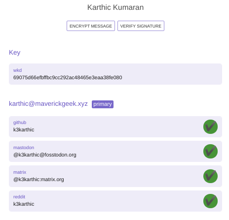
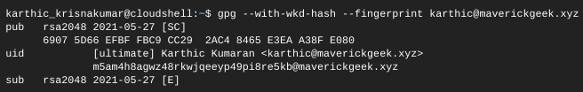
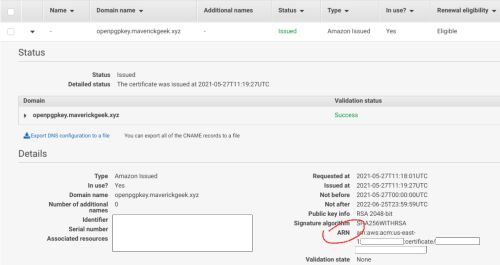

# Terraform - Host a Web Key Directory (WKD)
A [Terraform](https://www.terraform.io/) script to host a [Web Key Directory (WKD)](https://wiki.gnupg.org/WKD). It serves an [OpenPGP](https://en.wikipedia.org/wiki/Pretty_Good_Privacy) public key at `https://openpgpkey.<domain.name>` using the [WKD Advanced Setup](https://keyoxide.org/guides/web-key-directory#the-advanced-setup).

An [Amazon S3](https://aws.amazon.com/s3/) bucket stores the key and [Amazon CloudFront](https://aws.amazon.com/cloudfront/) is the [Content Delivery Network (CDN)](https://en.wikipedia.org/wiki/Content_delivery_network). The Amazon S3 [CORS](https://developer.mozilla.org/en-US/docs/Web/HTTP/CORS) allows [Keyoxide](https://keyoxide.org/) access to the public key.

**Demo:** [https://keyoxide.org/wkd/karthic%40maverickgeek.xyz](https://keyoxide.org/wkd/karthic%40maverickgeek.xyz)



## Code Mirrors

* GitHub: [github.com/k3karthic/terraform__wkd](https://github.com/k3karthic/terraform__wkd/)
* Codeberg: [codeberg.org/k3karthic/terraform__wkd](https://codeberg.org/k3karthic/terraform__wkd)

## Configuration

*Step 1:* Create a file to store the [Terraform input variables](https://www.terraform.io/docs/language/values/variables.html). Use `mumbai.tfvars.sample` as a reference. Keep `mumbai.tfvars` as the filename or change the name in the following files,
	1. `.gitignore`
	1. `bin/plan.sh`
	1. `bin/encrypt.sh`
	1. `bin/decrypt.sh`

*Step 2:* Get the WKD hash for your public key using the following gpg command and save it as `key_hash`. The hash is just below the `uid` as `<hash>@<domain>`.
```
$ gpg --with-wkd-hash --fingerprint <email address>
```


*Step 3:* Export your public key into the `keys` folder using the script `bin/update_key.sh`.

*Step 4:* Update the following in in `bin/update_key.sh`,
1. Replace `A38FE080` with your public key id
2. Replace `m5am4h8agwz48rkwjqeeyp49pi8re5kb` with your WKD hash 

*Step 5:* Fetch a certificate from [AWS Certificate Manager](https://aws.amazon.com/certificate-manager/) in [US East (N. Virginia)](https://docs.aws.amazon.com/AmazonCloudFront/latest/DeveloperGuide/cnames-and-https-requirements.html#https-requirements-aws-region) for your domain. Save the ARN in `acm_arn`.



## Authentication

Documentation for the [HashiCorp AWS provider](https://registry.terraform.io/providers/hashicorp/aws/latest/docs) is available at [registry.terraform.io/providers/hashicorp/aws/latest/docs](https://registry.terraform.io/providers/hashicorp/aws/latest/docs).

[AWS CloudShell](https://aws.amazon.com/cloudshell/) can deploy this this script without configuration.

## Deployment

*Step 1:* Use the following command to create a [Terraform plan](https://www.terraform.io/docs/cli/run/index.html#planning).
```
$ ./bin/plan.sh
```

To avoid fetching the latest state of resources, use the following command.
```
$ ./bin/plan.sh -refresh=false
```

*Step 2:* Review the plan using the following command.
```
$ ./bin/view.sh
```

*Step 3:* [Apply](https://www.terraform.io/docs/cli/run/index.html#applying) the plan using the following command.
```
$ ./bin/apply.sh
```

## Encryption

Encrypt sensitive files (input variables, [Terraform state](https://www.terraform.io/docs/language/state/index.html) files) before saving them. `.gitignore` must contain the unencrypted file paths.

Use the following command to decrypt the files after cloning the repository.
```
$ ./bin/decrypt.sh
```

Use the following command after running `bin/apply.sh` to encrypt the updated state files.
```
$ ./bin/encrypt.sh <gpg key id>
```
